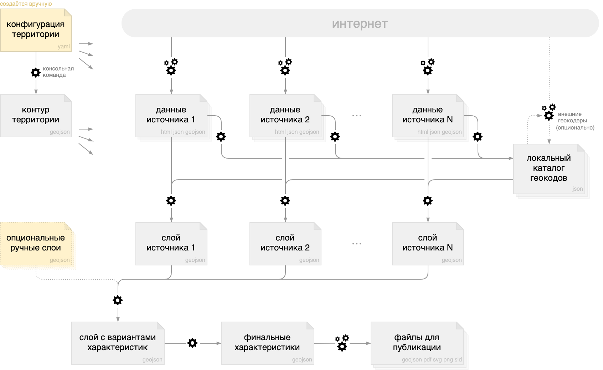
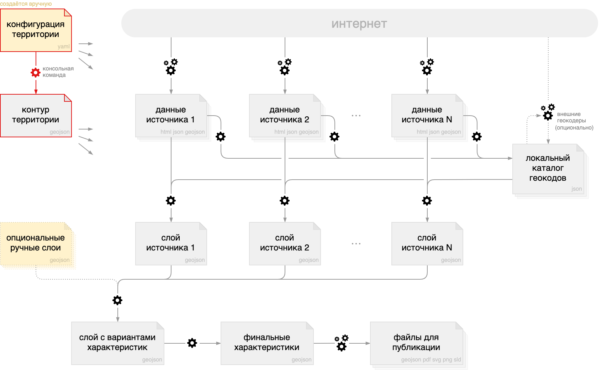
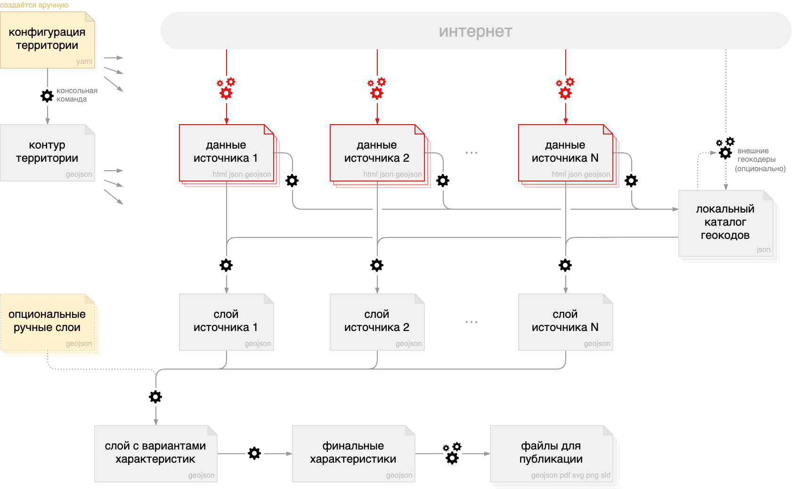
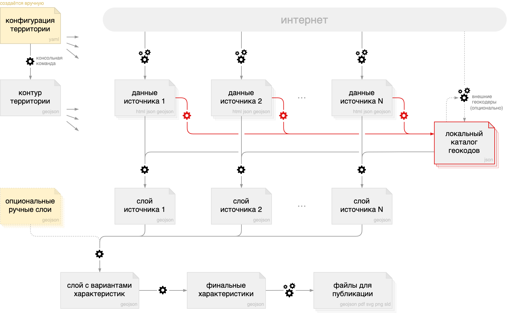
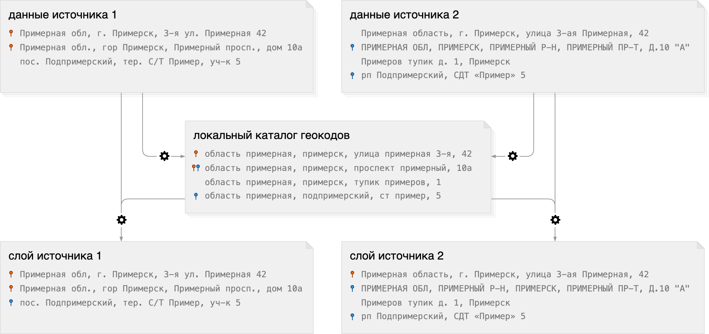
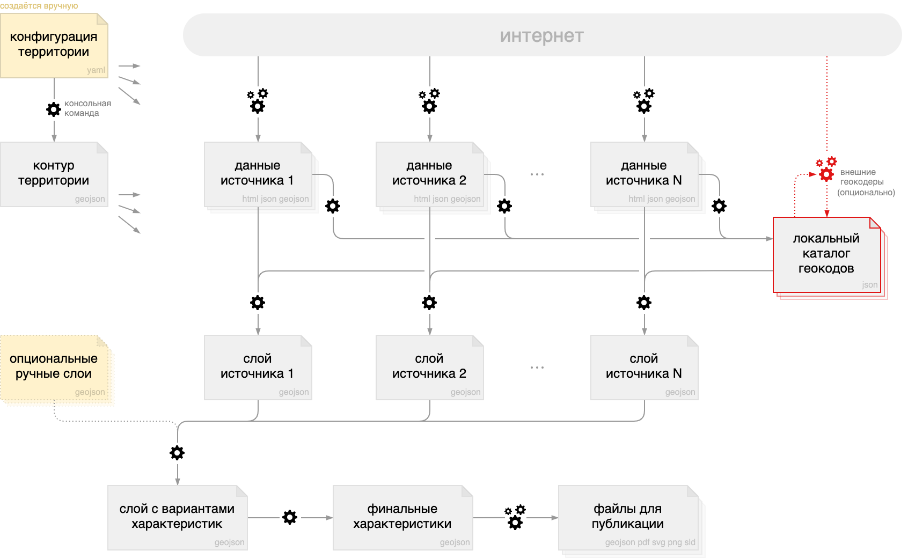
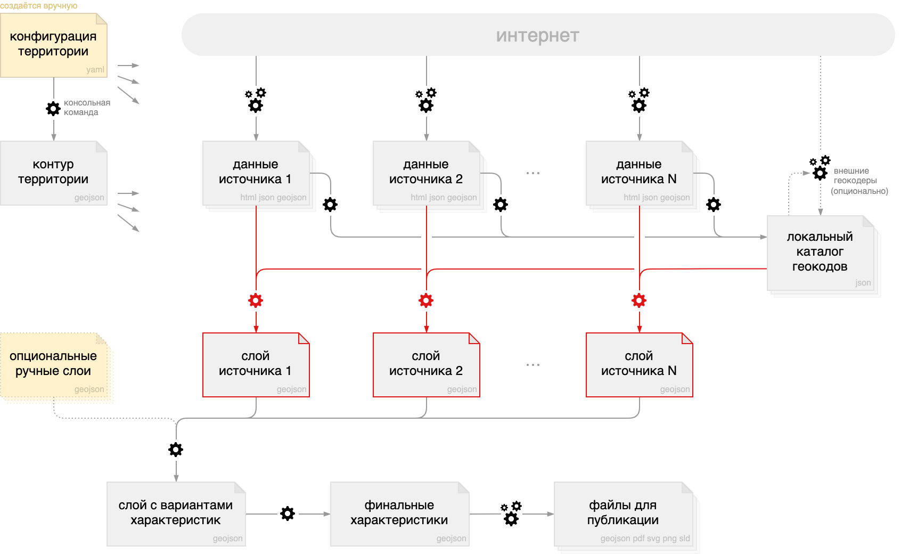
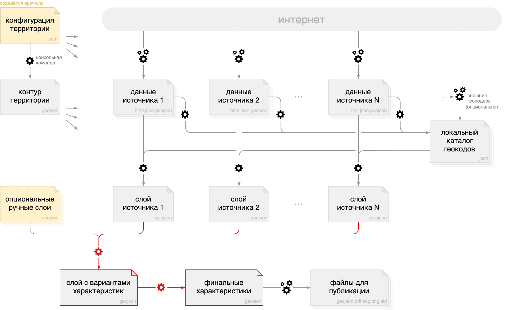
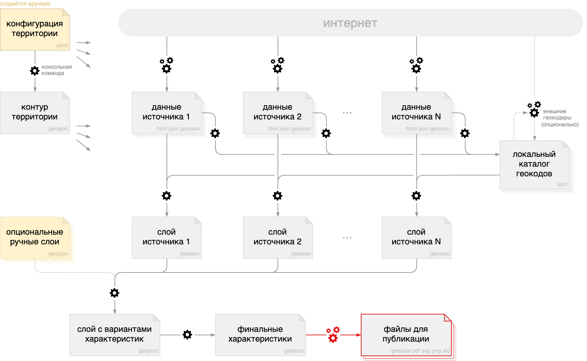

# Tooling for [how-old-is-this.house](https://how-old-is-this.house/en)

This repository helps assemble a geographic dataset with building infos.
Attributes are gathered from multiple sources and include _construction year_, _floor count_, _address_, _architect_, _photo_, _wikipedia page URL_ and so on.
The entire process consists of launching console commands, which invoke scripts written in TypeScript.
The results of data collection and processing are automatically turned into uploadable and printable artifacts.

To run the scripts, you need to specify a geographic territory, which is usually a single city or town.
You can also supplement data from remote sources with manually created features.
This helps mitigate potential data quality issues that cannot be resolved upstream.

<!--markdownlint-disable no-inline-html -->

<center></center>

<!--markdownlint-enable no-inline-html -->

Because [how-old-is-this.house](https://how-old-is-this.house/en) focuses on cities in Russia, the instructions below are in Russian.
Although some of the data sources are country-specific, most parts of the repo can be recycled for a global re-use.

👀 [English version via Google Translate](https://translate.google.com/translate?sl=ru&tl=en&u=https://github.com/kachkaev/tooling-for-how-old-is-this-house/blob/main/README.md)

---

## Источники данных

🔢 финальные характеристики здания (цифра означает приоритет)  
⏳ временно используемые вспомогательные данные  
🗑 данные игнорируются из-за редкости или низкого качества

📍 точка (point)  
🟥 контур (polygon / multipolygon)

<!-- prettier-ignore-start -->

| | адрес | архитектор |геометрия |  год | название  | стиль | фото | этажность | 🔗 Викиданные | 🔗 Википедия | 🔗 Минкультуры | 🔗 сайт | 
| :- | :-: | :-: | :-: | :-: | :-: | :-: | :-: | :-: | :-: | :-: | :-: | :-: |
|<!-- mingkh     --> **[«МинЖКХ»](https://mingkh.ru)**           | 3️⃣ |    | ⏳ 📍 | 4️⃣ |    |   |   | 2️⃣ |    |
|<!-- mkrf       --> **[Минкультуры](https://opendata.mkrf.ru)** | 2️⃣ |    | ⏳ 📍 | 1️⃣ | 3️⃣ |   | 4️⃣ |   |    |    | 1️⃣ |
|<!-- osm        --> **[ОСМ](https://www.openstreetmap.org)**    | 1️⃣ | 1️⃣ | 1️⃣ 🟥 | 3️⃣ | 2️⃣ | 1️⃣ | 3️⃣ | 1️⃣ | 3️⃣ | 3️⃣ |    | 2️⃣
|<!-- rosreestr  --> **[Росреестр](https://rosreestr.gov.ru)**   | 4️⃣ |    | ⏳ 📍 | 5️⃣ | 🗑 |   |    | 3️⃣ |
|<!-- wikidata   --> **[Викиданные](https://www.wikidata.org)**  | 🗑 | 2️⃣ | ⏳ 📍 | 🗑 | 1️⃣ | 2️⃣ | 1️⃣ |   | 1️⃣ | 1️⃣ |
|<!-- wikimapia  --> **[Викимапия](https://wikimapia.org)**      | 🗑 |    | ⏳ 🟥 | 6️⃣ | 5️⃣ |   | 5️⃣ |   |    | 🗑 |
|<!-- wikivoyage --> **[Викигид](https://ru.wikivoyage.org)**    | 5️⃣ | 3️⃣ | ⏳ 📍 | 2️⃣ | 4️⃣ | 3️⃣ | 2️⃣ |   | 2️⃣ | 2️⃣ |    | 1️⃣

<!-- prettier-ignore-end -->

## Инструкции

Чтобы создать новую карту возраста домов, вам понадобятся:

- базовое понимание [командной строки](https://ru.wikipedia.org/wiki/Интерфейс_командной_строки) (терминала),
- небольшой опыт работы с [гитом](https://ru.wikipedia.org/wiki/Git) (системой контроля версий),
- поверхностное знакомство с форматами [GeoJSON](https://ru.wikipedia.org/wiki/GeoJSON) и [YAML](https://ru.wikipedia.org/wiki/YAML).

В качестве текстового редактора рекомендуется [VSCode](https://code.visualstudio.com) с расширениями
[DotENV](https://marketplace.visualstudio.com/items?itemName=mikestead.dotenv),
[Geo Data Viewer](https://marketplace.visualstudio.com/items?itemName=RandomFractalsInc.geo-data-viewer),
[Git Graph](https://marketplace.visualstudio.com/items?itemName=mhutchie.git-graph),
[Git Lens](https://marketplace.visualstudio.com/items?itemName=eamodio.gitlens),
[Wikitext](https://marketplace.visualstudio.com/items?itemName=rowewilsonfrederiskholme.wikitext) и
[Yaml](https://marketplace.visualstudio.com/items?itemName=redhat.vscode-yaml).
Для визуализации полученных данных подойдёт любая геоинформационная программа (например, [QGIS](https://qgis.org/ru/site/)).

В упоминаемых папках и файлах `/path/to` условно обозначает локальную папку, которую вы выделили под проект.
Например, если на вашем компьютере это `/Users/me/projects/how-old-is-this-house`, то `/path/to/some-folder` в инструкциях означает `/Users/me/projects/how-old-is-this-house/some-folder`.

### Требования к системе

Для запуска скриптов подойдёт любой относительно современный компьютер с любой операционной системой (Linux, macOS, Windows).
Для обработки территории с населением порядка миллиона человека хватит 2-4 ГБ оперативной памяти и порядка 1 ГБ свободного места на диске.
Скорее всего, бутылочным горлышком будет пропускная способность интернета и ограничения, которые накладывают источники на скорость скачивания данных.

### Подготовка к работе

Эти шаги достаточно выполнить один раз, даже если вы планируете сбор данных для нескольких территорий.

1.  Убедитесь, что на машине установлены [гит](https://git-scm.com/) (система контроля версий) и [нода](https://nodejs.org/ru/) (среда запуска скриптов).
    При установке ноды рекомендуется выбрать версию LTS.

    Команды для проверки установки:

    ```sh
    git --version
    ## покажет ≥ 2.30
    
    node --version
    ## покажет ≥ 14.16
    ```

1.  Установите последнюю версию [ярна](https://yarnpkg.com) (менеджера зависимостей):

    ```sh
    npm install --global yarn
    ```

    Команда для проверки установки:

    ```sh
    yarn --version
    ## покажет ≥ 1.22
    ```

1.  [Клонируйте](https://docs.github.com/en/github/creating-cloning-and-archiving-repositories/cloning-a-repository) этот репозиторий в папку `/path/to/tooling`.

    Если результат оказался в другой папке, например, `/path/to/tooling-for-how-old-is-this-house` или `/path/to/tooling/tooling-for-how-old-is-this-house`, то папку можно перенести.
    Связь с гитхабом при этом не потеряется.
    В качестве самопроверки убедитесь, что на вашем компьютере существует файл `/path/to/tooling/README.md`.

    Про `/path/to` написано выше.

1.  Откройте терминал, перейдите в папку `/path/to/tooling`:

    ```sh
    cd "/path/to/tooling"
    ```

    Название этой папки должно появиться слева от места ввода команды.

1.  Будучи в папке `/path/to/tooling`, установите зависимые библиотеки:

    ```sh
    yarn install
    ```

    Это займёт пару минут.

1.  Будучи в папке `/path/to/tooling`, создайте пустой файл `.env.local`:

    ```sh
    yarn exe scripts/ensure-dot-env-local.ts
    ```

    Запуск этой консольной команды помогает проверить общую работоспособность скриптов.
    Если возникла ошибка, следует заново пройтись по инструкции (видимо, что-то пропустили).

### Подготовка данных Минкультуры

Этот раздел можно пропустить, если вы собираетесь работать над уже начатой территорией.
Инструкции достаточно выполнить один раз, даже если вы планируете сбор данных для нескольких городов.

1.  Скачайте список объектов с сайта Министерства культуры РФ:  
    [opendata.mkrf.ru/opendata/7705851331-egrkn](https://opendata.mkrf.ru/opendata/7705851331-egrkn)

    Ссылка на архив — в правом верхнем углу страницы.
    Файл должен быть в формате `jsons` (с `s` на конце).

1.  Разархивируйте скаченный файл и поместить его в папку `/path/to/data/sources/mkrf`.
    Название файла желательно не менять.

    > 🚩 **Пользователям macOS и Ubuntu**  
    > Встроенная программа для распаковки архивов отрезает у файла хвост.
    > Чтобы этого избежать, откройте папку со скаченным архивом в терминале и распакуйте его командой `unzip`:
    >
    > ```sh
    > unzip data-50-structure-6.jsons.zip -d .
    > ```

1.  Откройте файл `/path/to/tooling/.env.local` как текстовый и задайте переменную `MKRF_JSONS_DUMP_FILE_PATH`.
    Она указывает путь к скаченному файлу.
    Файл `.env.local` станет выглядеть примерно так:

    ```ini
    MKRF_JSONS_DUMP_FILE_PATH=../data/sources/mkrf/data-50-structure-6.jsons
    ```

    В пути к файлу может быть другая цифра вместо `50`.
    Она означает версию данных.

1.  Будучи в папке `/path/to/tooling`, проверьте выполнение предыдущих шагов:

    ```sh
    yarn exe scripts/2-sources/mkrf/0-check-jsons-dump.ts
    ```

### Обработка выбранной территории

<!--markdownlint-disable no-inline-html -->
<center></center>
<!--markdownlint-enable no-inline-html -->

Скрипты в этом репозитории подходят для обработки любой части РФ.
Рекомендуется ограничиваться компактной территорией, например, одной городской агломерацией.
Из-за особенностей процесса получения данных, попытка за раз охватить большую, но при этом малонаселённую территорию, будет неэффективной.

Созданные в рамках этого проекта данные желательно хранить в гит-репозитории.
Это позволяет отслеживать изменения в файлах, делать их резервные копии и работать над территориями совместно.
Репозиторий с данными и репозиторий со скриптами хранятся отдельно друг от друга.
Данные разных территорий хранятся в независимых друг от друга гит-ветках.

#### Подготовка территории

<!--markdownlint-disable no-inline-html -->
<center></center>
<!--markdownlint-enable no-inline-html -->

Перед выполнением шагов в этом разделе вам надо получить доступ к непубличному репозиторию, в котором будут храниться промежуточные данные.
Для этого свяжитесь с автором скриптов или администраторами [how-old-is-this.house](https://how-old-is-this.house).
Вы должны быть зарегистрированным пользователем на гитхабе и сообщить свой ник.

После получения доступа:

1.  Создайте локальную папку `/path/to/data/territories`.

1.  Клонируйте созданную для вас ветку в папку `/path/to/data/territories/TERRITORY_NAME`.

    `TERRITORY_NAME` — это название города или части субъекта РФ (например, `pnz-penza` или `mo-saransk`).
    Название папки соответствует названию ветки репозитория с данными (`territories/TERRITORY_NAME`).

1.  Откройте файл `/path/to/tooling/.env.local` как текстовый и укажите путь к выбранной территории.
    Это делается добавлением такой строчки:

    ```ini
    TERRITORY_DATA_DIR_PATH=../data/territories/TERRITORY_NAME
    ```

    Часть `TERRITORY_NAME` надо заменить на реальное название папки.

1.  Если территория новая (то есть ещё не начата кем-то другим), заполните файл `/path/to/data/territories/TERRITORY_NAME/territory-config.yml`.
    Шаблон этого файла уже будет создан до вас.
    Внутри — комментарии с подсказками.

1.  Если территория новая, постройте её границу согласно настройкам в `territory-config.yml` → `extent`:

    ```sh
    yarn exe scripts/1-build-territory-extent.ts
    ```

    Эта команда создаст файл `/path/to/data/territories/TERRITORY_NAME/territory-extent.geojson`.

    Вместо запуска команды вы можете задать границу территории самостоятельно.
    Для этого надо самостоятельно сохранить любой объект `Polygon` в файл `territory-extent.geojson`.

    Желательно подбирать границы территории так, чтобы они повторяли контуры кадастровых кварталов.
    Это повысит эффективность работы с АПИ Росреестра.

1.  Закоммитьте и запушьте изменения в файлах `territory-config.yml` и `territory-extent.yml` при помощи гита.

    Этот шаг упростит дальнейшую работу над территорий и обеспечит вас резервной копией.

#### Получение исходных данных

<!--markdownlint-disable no-inline-html -->
<center></center>
<!--markdownlint-enable no-inline-html -->

Все нижеперечисленные команды выполняются из папки `/path/to/tooling`.
Перед их запуском важно выполнить инструкции в предыдущих разделах.

Скрипты выполняются по очереди сверху вниз.
Если у вас возникает проблема с одним из источников, вы можете по-прежнему запускать скрипты, которые не упоминают этот источник.
Например, если что-то пошло не так с Росреестром, достаточно начать игнорировать все последующие скрипты `*/rosreestr/*` и можно пройти весь процесс до конца.
Финальный набор данных будет неполным, но это легко исправить потом — достаточно перезапустить скрипты.

Если вы совместно работаете над одной территорией, то вам можно пропустить некоторые шаги в этом разделе.
Какие именно — зависит от того, что уже успели сделать до вас.

После запуска скриптов важно не забывать проверять статус локального гит-репозитория с данными: `/path/to/data/territories/TERRITORY_NAME`.

- Полученные исходные данные отображаются как изменения в репозитории.
  Эти файлы важно коммитить и пушить.

- Промежуточные и итоговые наборы данных дешевле перегенерировать локально, чем хранить в репозитории.
  Такие файлы будут автоматически добавлены в `/path/to/data/territories/TERRITORY_NAME/.gitignore`.

Потратив пару лишних минут на гит после запуска очередного скрипта, вы можете легко сэкономить себе несколько часов.
Гит даёт возможность откатывать данные до предыдущих версий, если что-то пошло не так.
Такая защита позволяет проводить эксперименты без страха что-то испортить или удалить.

##### [«МинЖКХ»](https://dom.mingkh.ru)

1.  Скачайте списки зданий на страницах, которые перечислены в файле `territory-config.yml`:

    ```sh
    yarn exe scripts/2-sources/mingkh/1-fetch-house-lists.ts
    ```

1.  Скачайте и обработайте данные по зданиями:

    ```sh
    yarn exe scripts/2-sources/mingkh/2-fetch-raw-house-infos.ts
    yarn exe scripts/2-sources/mingkh/3-parse-raw-house-infos.ts
    ```

1.  ![][опционально]  
    Создайте временный файл для анализа промежуточного результата:

    ```sh
    yarn exe scripts/2-sources/mingkh/4-preview-house-infos.ts
    ```

##### [Минкультуры](https://opendata.mkrf.ru)

1.  Извлеките данные для вашей территории из скаченного ранее дампа:

    ```sh
    yarn exe scripts/2-sources/mkrf/1-extract-objects-from-jsons-dump.ts
    ```

##### [ОСМ](https://www.openstreetmap.org)

1.  Скачайте контуры зданий и административные границы:

    ```sh
    yarn exe scripts/2-sources/osm/1-fetch-buildings.ts
    yarn exe scripts/2-sources/osm/2-fetch-boundaries-for-regions.ts
    yarn exe scripts/2-sources/osm/3-fetch-boundaries-for-settlements.ts
    ```

1.  ![][опционально]  
    Скачайте контуры водных объектов и дорог (они понадобятся только для визуализации):

    ```sh
    yarn exe scripts/2-sources/osm/4-fetch-railways.ts
    yarn exe scripts/2-sources/osm/5-fetch-roads.ts
    yarn exe scripts/2-sources/osm/6-fetch-water-objects.ts
    ```

##### [Росреестр](https://pkk.rosreestr.ru)

1.  Скачайте геопривязанные ОКС (объекты капитального строительства) и земельные участки:

    ```sh
    yarn exe scripts/2-sources/rosreestr/1-fetch-tiles-with-ccos.ts
    yarn exe scripts/2-sources/rosreestr/2-fetch-tiles-with-lots.ts
    ```

1.  ![][опционально]  
    Создайте временные файлы для анализа промежуточного результата:

    ```sh
    yarn exe scripts/2-sources/rosreestr/3-preview-tile-data.ts
    ```

1.  Создайте файлы-страницы для хранения деталей объектов:

    ```sh
    yarn exe scripts/2-sources/rosreestr/4-generate-initial-object-info-pages.ts
    ```

1.  Скачайте детали объектов из АПИ `fir_object`:

    ```sh
    yarn exe scripts/2-sources/rosreestr/5-fetch-object-infos-from-fir-api.ts
    ```

    Этот скрипт поддерживает многозадачность.
    Вы можете открыть до десяти терминалов и запустить его в каждом окне, чтобы ускорить процесс.

1.  Скачайте детали объектов из АПИ ПКК, чтобы закрыть оставшиеся пробелы:

    ```sh
    yarn exe scripts/2-sources/rosreestr/6-fetch-object-infos-from-pkk-api.ts
    ```

    Этот скрипт не поддерживает многозадачность.
    Запуск слишком большого числа запросов к серверу приводит к блокировке айпи-адреса.

1.  Расширьте список кадастровых номеров, если это необходимо.

    Созданные ранее файлы-страницы заканчиваются несколькими десятками пустых кадастровых номеров.
    После опроса АПИ некоторые кварталы могут заполниться данными «под завязку».
    Это значит, что есть вероятность найти ещё больше объектов, если добавить страниц.

    ```sh
    yarn exe scripts/2-sources/rosreestr/7-add-extra-object-info-pages.ts
    ```

    Если новые страницы добавились, следует перезапустить скрипт `5-fetch-object-infos-from-fir-api.ts` и `6-fetch-object-infos-from-pkk-api.ts`.

    Вероятно, процесс добавления и простукивания страниц придётся повторять несколько раз.
    Если очередной запуск скрипта `7-add-extra-object-info-pages.ts` не добавил ни одной страницы, данные Росреестра можно считать собранными.

    ***

    Списки кадастровых номеров иногда содержат пустоты длиной в несколько сотен объектов.
    Они возникают при сносе многоквартирных домов.
    Если за такими пустотами следуют только объекты без координат, то расширение и простукивание диапазонов кадастровых номеров не даст «дотянуться» до некоторых данных.

    Вероятность такой ситуации крайне мала; вы узнаете о ней только после смешивания и визуализации всех данных.
    Проблема даст о себе знать большим количеством зданий без года постройки в одном из районов.

    Если вы нашли кадастровые номера, до которых скрипты «не дотягиваются», то вы можете вручную указать их в файле `territory-config.yml`:

    ```yml
    sources:
      # ...
      rosreestr:
        handpickedCnsForPageInfos:
          - ××:××:×××××××:×××
          - ××:××:×××××××:×××
    ```

    На каждый проблемный квартал достаточно ввести только один кадастровый номер (максимальный из найденных вручную).
    После обновления файла `territory-config.yml` надо перезапустить скрипт `4-generate-initial-object-info-pages` и все последующие в этом подразделе.

##### [Викиданные](https://www.wikidata.org)

1.  Скачайте элементы внутри территории:

    ```sh
    yarn exe scripts/2-sources/wikidata/1-fetch-items.ts
    ```

##### [Викимапия](https://wikimapia.org)

1.  Скачайте контуры объектов:

    ```sh
    yarn exe scripts/2-sources/wikimapia/1-fetch-tiles.ts
    ```

1.  ![][опционально]  
    Создайте временные файлы для анализа промежуточного результата:

    ```sh
    yarn exe scripts/2-sources/wikimapia/2-preview-tile-data.ts
    ```

1.  Скачайте и обработайте детали объектов:

    ```sh
    yarn exe scripts/2-sources/wikimapia/3-fetch-raw-object-infos.ts
    yarn exe scripts/2-sources/wikimapia/4-parse-raw-object-infos.ts
    ```

##### [Викигид](https://ru.wikivoyage.org)

1.  Скачайте страницы, которые перечислены в `territory-config.yml` → `sources` → `wikivoyage`:

    ```sh
    yarn exe scripts/2-sources/wikivoyage/1-fetch-pages.ts
    ```

#### Создание локального каталога геокодов

<!--markdownlint-disable no-inline-html -->
<center></center>
<!--markdownlint-enable no-inline-html -->

Геокодирование — это процесс связывания адреса объекта и его координат.
В собранных нами данных есть здания с адресом и координатами, а также записи, где координаты отсутствуют.
Собрав каталог геокодов, мы уменьшим количество объектов без координат.

<!--markdownlint-disable no-inline-html -->
<center></center>
<!--markdownlint-enable no-inline-html -->

Скрипты для пока ещё неготовых источников следует пропустить.
Их можно запускать в любом порядке.

```sh
yarn exe scripts/2-sources/mingkh/8-report-geocodes.ts
yarn exe scripts/2-sources/mkrf/8-report-geocodes.ts
yarn exe scripts/2-sources/osm/8-report-geocodes.ts
yarn exe scripts/2-sources/rosreestr/8-report-geocodes.ts
yarn exe scripts/2-sources/wikidata/8-report-geocodes.ts
yarn exe scripts/2-sources/wikimapia/8-report-geocodes.ts
yarn exe scripts/2-sources/wikivoyage/8-report-geocodes.ts
```

Результат работы скриптов будет в папке `/path/to/data/territories/TERRITORY_NAME/geocoding`.
Созданные файлы игнорируются гитом, то есть их не придётся добавлять в репозиторий с данными.
Перечисленные выше скрипты следует перезапускать в случае изменения исходных данных.

<!-- TODO: Написать про territory-config.yml → addressHandling -->

#### Заполнение пробелов в локальном каталоге геокодов

![][опционально]

<!--markdownlint-disable no-inline-html -->
<center></center>
<!--markdownlint-enable no-inline-html -->

Сопоставление адресов и географических координат из разных источников существенно улучшает качество смешивания данных.
Тем не менее, координаты некоторых зданий по-прежнему остаются неизвестными.
Для их получения можно воспользоваться сторонним сервисом, в частности [геокодером от Яндекса](https://yandex.ru/dev/maps/geocoder/).
Этот этап улучшает финальный результат, но не является решающим.
Его можно пропустить или выполнить позже.

Полнота данных ОСМ на выбранной территории существенно влияет на количество пробелов в каталоге геокодов.
Чтобы уменьшить зависимость от стороннего геокодера, попробуйте улучшить данные в ОСМ и потом скачать их заново.
Пример такого мини-проекта — [пензенская картовечеринка](https://wiki.openstreetmap.org/wiki/RU:Пенза/картовечеринка-2021-02).

Чтобы воспользоваться геокодером от Яндекса, вам потребуется ключ для их АПИ.
Его получают на странице [developer.tech.yandex.ru/services](https://developer.tech.yandex.ru/services) (следует выбрать _JavaScript API и HTTP Геокодер_).
Важно, чтобы у вас было разрешение кэшировать ответы сервера, иначе вы будете нарушать лицензионное соглашение.

1.  Добавьте ключ от АПИ в файл `/path/to/tooling/.env.local`:

    ```ini
    YANDEX_GEOCODER_API_KEY=xxxxxxxx-xxxx-xxxx-xxxx-xxxxxxxxxxxx
    ```

1.  Запустите геокодер и сохраните результат в кэш:

    ```sh
    yarn exe scripts/2-sources/yandex/1-geocode-addresses-without-position.ts
    ```

    В зависимости от лимита запросов для вашего ключа, вам может понадобиться несколько дней, чтобы закрыть все пробелы.
    Скрипт завершит свою работу при достижении лимита, а вам на электронную почту придёт письмо от Яндекса.
    Доступ к АПИ геокодера будет ограничен до конца суток.

    Можно продолжать обработку данных, не дожидаясь полного геокодирования адресов, а потом вернуться к этому шагу.

1.  Добавьте полученные геокоды в каталог:

    ```sh
    yarn exe scripts/2-sources/yandex/8-report-geocodes.ts
    ```

    Как и на предыдущем шаге, результат скрипта `*/8-report-geocodes.ts` не попадает в гит-репозиторий.
    Значит, этот скрипт надо выполнить каждый раз при клонировании или обновлении репозитория с данными.

---

Если вы подготавливаете данные итерациями, некоторые геокоды Яндекса могут стать лишними.
Например, это происходит после улучшения данных ОСМ.
Чтобы удалить лишние файлы из кэша, воспользуетесь этим скриптом:

```sh
yarn exe scripts/2-sources/yandex/2-delete-cache-entries-for-unused-addresses.ts
```

#### Подготовка к смешиванию данных

<!--markdownlint-disable no-inline-html -->
<center></center>
<!--markdownlint-enable no-inline-html -->

У нас есть исходные данные из нескольких источников, а также локальный каталог геокодов.
Чтобы объединить источники, нам нужно привести все данные к единому формату и заполнить недостающие геокоды.

Единица смешивания данных — стандартизированный файл (слой).
Для каждого источника создаётся по одному слою.

Скрипты для пока ещё неготовых источников следует пропустить.
Их можно запускать в любом порядке.

```sh
yarn exe scripts/2-sources/mingkh/9-extract-output-layer.ts
yarn exe scripts/2-sources/mkrf/9-extract-output-layer.ts
yarn exe scripts/2-sources/osm/9-extract-output-layer.ts
yarn exe scripts/2-sources/rosreestr/9-extract-output-layer.ts
yarn exe scripts/2-sources/wikidata/9-extract-output-layer.ts
yarn exe scripts/2-sources/wikimapia/9-extract-output-layer.ts
yarn exe scripts/2-sources/wikivoyage/9-extract-output-layer.ts
```

Результатом работы скриптов станут файлы `/path/to/data/territories/TERRITORY_NAME/sources/*/output-layer.geojson`.
Они игнорируется гитом, потому что их дешевле перегенерировать, чем хранить.
Файлы `output-layer.geojson` следует перегенерировать после изменения исходных данных или обновления каталога геокодов.

<!-- TODO: добавить про territory-config → sources → mkrf → fixedLonLatById -->

#### Смешивание данных

<!--markdownlint-disable no-inline-html -->
<center></center>
<!--markdownlint-enable no-inline-html -->

Этот финальный этап обработки данных комбинирует слои, которые мы получили на предыдущем шаге.

Исходные слои выполняют одну из двух ролей: являются _базой_ (источником геометрии и характеристик) или _заплаткой_ (только источником характеристик).
Роль базового слоя выполняет ОСМ, все остальные источники — заплатки.

1.  Смешайте базовые слои и заплатки:

    ```sh
    yarn exe scripts/3-mixing/1-mix-output-layers.ts
    ```

1.  Запустите скрипт выбора финальных характеристик из нескольких вариантов:

    ```sh
    yarn exe scripts/3-mixing/2-mix-property-variants.ts
    ```

Всё готово! 🎉

#### Просмотр результата

![][опционально]

Результат смешивания данных откроется в любой
геоинформационной программе (например, [QGIS](https://qgis.org/ru/site/)).
Есть возможность отобразить его в браузере.
Для этого надо запустить веб-сервер из папки `/path/to/tooling`:

```sh
yarn dev
```

Скрипт останется запущенным в терминале до нажатия `ctrl+c`.
Пока веб-сервер работает, черновик постера и гистограмма годов постройки доступны по адресу [localhost:3000](http://localhost:3000).

Размеры, цвета и другие параметры постера задаются в `territory-config.yml` → `poster`.

#### Корректировка результата

![][опционально]

<!--markdownlint-disable no-inline-html -->
<center></center>
<!--markdownlint-enable no-inline-html -->

Запуск скриптов не требует ручных шагов по обработке данных.
Как следствие, ошибки в источниках неизбежно попадают в финальные характеристики зданий.

Чтобы повысить качество и полноту результата, предусмотрена возможность подмешивать опциональные ручные слои.
Это позволяет добавлять на карту особые объекты (например, мосты) или исправлять ошибки в характеристиках (например, корректировать год постройки).

Как и файлы `/path/to/data/territories/TERRITORY_NAME/sources/*/output-layer.geojson`, ручные слои — это файлы `*.geojson`.
Их помещают в папку `/path/to/data/territories/TERRITORY_NAME/sources/manual`.
Название файла может быть любым (например, `bridges.geojson`), а число таких файлов неограниченно.
Структура содержимого — такая же, как у файлов `output-layer.geojson`.

Данные из папки `manual` имеют приоритет над остальными источниками.
При создании нового файла `*.geojson` важно не забыть указать `"layerRole": "base"` или `"layerRole": "patch"` — иначе этот слой будет проигнорирован при смешивании.

При ручном создании объекта-заплатки есть специальная возможность перечислить данные, которые следует проигнорировать при смешивании.
Например, в слое Минкультуры может быть снесённое здание, на месте которого построено новое, с уже правильными данными в Росреестре.
Чтобы исключить данные по снесённому зданию из результата, мы создаём файл `/path/to/data/territories/TERRITORY_NAME/sources/manual/patches.geojson` (`"layerRole": "patch"`).
В него добавляем точку с координатами внутри контура проблемного здания:

```json
{
  "type": "FeatureCollection",
  "layerRole": "patch",
  "privateNote": "Слой с заплатками (в этом месте может быть любая заметка)",
  "features": [
    {
      "type": "Feature",
      "geometry": {
        "type": "Point",
        "coordinates": [12.345678, 12.345678]
      },
      "properties": {
        "dataToOmit": "mkrf",
        "privateNote": "ул. Тестовая 42 отмечен как памятник архитектуры, а это уже небоскрёб"
      }
    }
  ]
}
```

Увидев `"dataToOmit": "mkrf"`, скрипты исключат характеристики здания по версии Минкультуры из финального набора данных.
Чтобы исправить другие случаи неправильного смешивания данных, следует добавить больше объектов `Feature` в этот же файл.

Кроме названия игнорируемого источника, можно указывать идентификатор объекта и конкретной характеристики через разделитель `|`.
Также разрешается перечислять несколько правил через запятую:

```json
"dataToOmit": "mkrf"
"dataToOmit": "mkrf|id12345"
"dataToOmit": "mkrf|id12345|completionTime"
"dataToOmit": "mkrf|*|completionTime"
"dataToOmit": "mkrf|id12345,mingkh|*|completionTime"
```

После обновления файлов `/path/to/data/territories/TERRITORY_NAME/sources/manual/*.geojson`, следует повторить скрипты в разделе «Смешивание слоёв».

Важно не заниматься ручным редактированием файлов во всех папках `/path/to/data/territories/TERRITORY_NAME/sources/*`, кроме `manual`.
Исправления в других подпапках сотрутся при обновлении данных.

Неточности в ОСМ проще всего исправлять на сайте [osm.org](https://www.openstreetmap.org), а потом заново скачивать улучшенные данные.
Инструкции для участия в проекте вы найдёте на [wiki.osm.org](https://wiki.openstreetmap.org/wiki/RU:Заглавная_страница).
При добавлении любых данных в базу ОСМ важно пользоваться только разрешёнными источниками.
Копировать содержимое других карт запрещено — сомнительные правки будут удалены участниками сообщества. [См. FAQ](https://wiki.openstreetmap.org/wiki/RU:FAQ).

#### Публикация результата

![][опционально]

<!--markdownlint-disable no-inline-html -->
<center></center>
<!--markdownlint-enable no-inline-html -->

Инструкции в этом разделе предназначены для тех, кто закончил подготовку данных и планирует их публикацию на сайте [how-old-is-this.house](https://how-old-is-this.house).

##### Черновик постера

```sh
yarn exe scripts/4-results/generate-poster.ts
```

##### Гистограмма годов постройки

```sh
yarn exe scripts/4-results/generate-histogram.ts
```

↑ Скрипт поддерживает переменную окружения `LOCALE=en`.

##### Слои для загрузки на Геосемантику

```sh
yarn exe scripts/4-results/generate-geosemantica-layers.ts
```

##### Стили слоёв

```sh
yarn exe scripts/4-results/generate-geosemantica-layer-styles.ts
```

##### Цветовая легенда

```sh
yarn exe scripts/4-results/generate-geosemantica-color-legend.ts
```

```sh
yarn exe scripts/4-results/generate-geosemantica-color-legend-demo.ts
```

↑ Скрипт поддерживает переменную окружения `LOCALE=en`.

[опционально]: https://img.shields.io/badge/-опционально-white.svg
